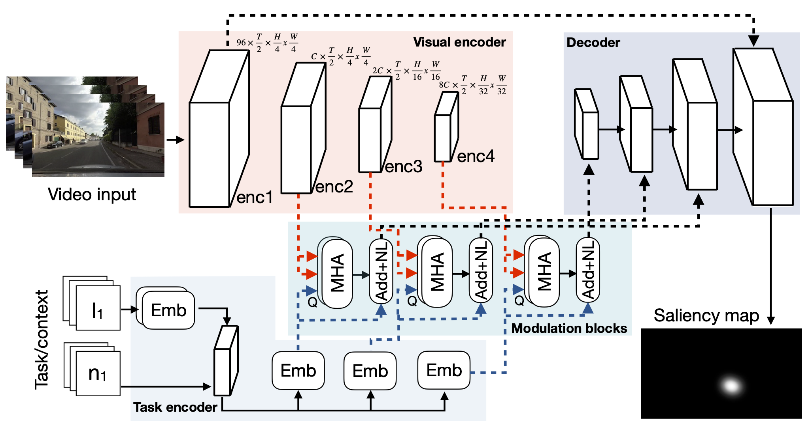
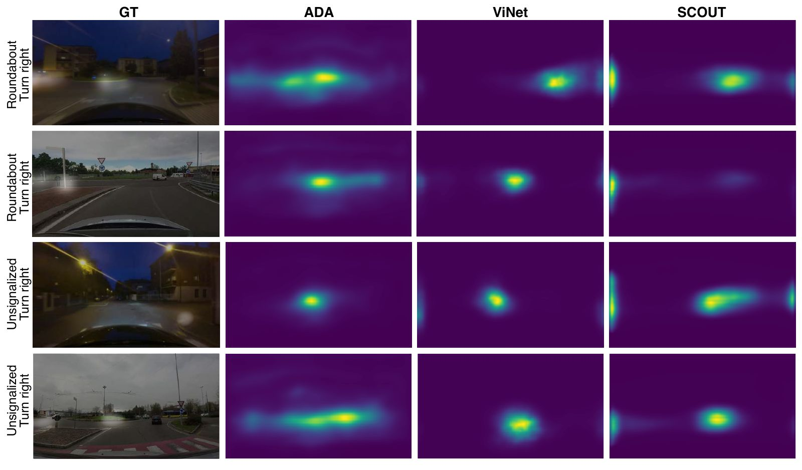
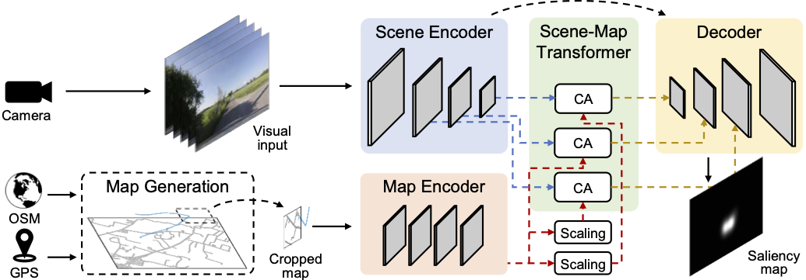
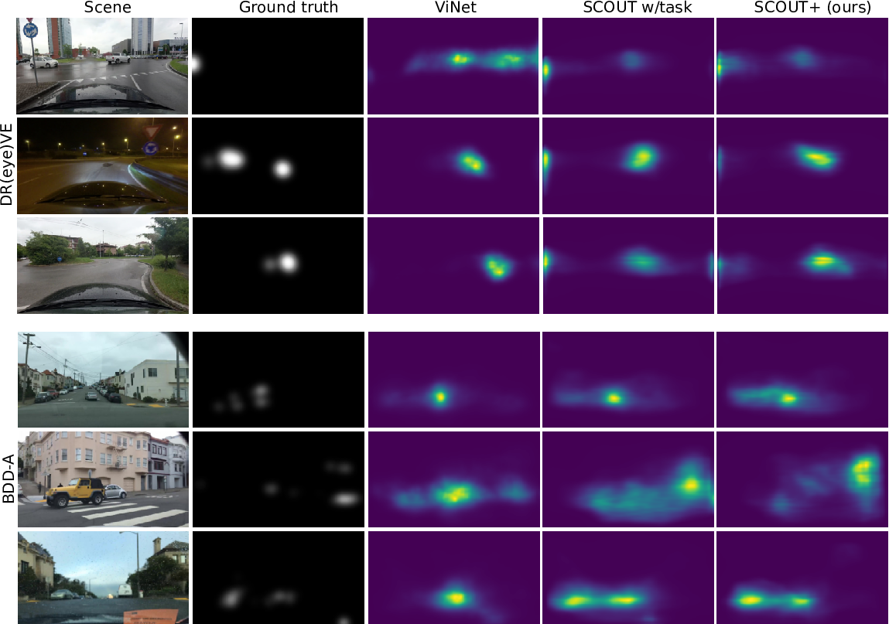

# SCOUT: Ta**s**k- and **C**ontext-M**o**d**u**lated A**t**tention

This is a repository for the following models and data:
- SCOUT and SCOUT+ models for task- and context-aware driver gaze prediction; 
- corrected and annotated ground truth for DR(eye)VE dataset; 
- extra annotations for drivers' actions and context for DR(eye)VE, BDD-A, and LBW datasets.

More information can be found in these papers:
- [I. Kotseruba, J.K. Tsotsos, "Understanding and Modeling the Effects of Task and Context on Drivers' Gaze Allocation", IV, 2024.](https://arxiv.org/abs/2310.09275). 
- [I. Kotseruba, J.K. Tsotsos, "SCOUT+: Towards practical task-driven drivers’ gaze prediction", IV, 2024.](https://arxiv.org/abs/2404.08756)
- [I. Kotseruba, J.K. Tsotsos, "Data limitations for modeling top-down effects on drivers’ attention", IV, 2024.](https://arxiv.org/abs/2404.08749v1)

#### Table of contents
* [SCOUT model description](#scout)
* [SCOUT+ model description](#scout+)
* [Annotations for DR(eye)VE, BDD-A, and LBW datasets](#annotations)
  * [DR(eye)VE](#dreyeve)
    * [Corrected and annotated gaze data](#dreyeve_gaze)
    * [New ground truth saliency maps](#dreyeve_gt)
    * [Maps](#maps)
  * [BDD-A](#bdd-a)
  * [LBW](#lbw)
  * [Task and context annotations for DR(eye)VE, BDD-A, and LBW](#task)
  * [Dataset utility functions](#data_utils)
* [Installation and running instructions](#installation)
  * [Setting up data](#data_setup)
  * [Installing the models](#model_setup)
  * [Training the models](#train)
  * [Testing the models](#test)
  * [Pretrained weights](#weights)
  * [Note on the Kullback-Leibler divergence metric](#kld)
* [Citation](#cite)

<a name="scout"></a>

## SCOUT

SCOUT is a model for drivers' gaze prediction that uses task and context information (represented as a set of numeric values and text labels) to modulate the output of the model, simulating top-down attentional mechanisms. 


<p align="center">

</p>

Since the model is aware of the driver's actions and context, it is able to anticipate maneuvers and pay attention to the relevant element of context unlike bottom-up models that are more reactive. The qualitative results of SCOUT and two state-of-the-art models demonstrate this on scenarios from DR(eye)VE involving maneuvers at the intersections. For example, when making turns at unsignalized intersections and during merging, the model correctly identifies intersecting roads and neighbouring lanes, respectively, as areas which the driver should examine.


<p align="center">
  
</p>

<a name="scout+"></a>

## SCOUT+

SCOUT+ is an extension of SCOUT that uses a map and route images instead of task and context labels, which is more similar to the information available to the human driver. 

<p align="center">

</p>

SCOUT+ achieves similar results as SCOUT, without relying on the precise labels and vehicle sensor information.

<p align="center">
  
</p>

<a name="annotations"></a>

## Annotations for DR(eye)VE, BDD-A, and LBW datasets

`extra_annotations` folder contains additional annotations for the datasets as described below.

<a name="dreyeve"></a>
### DR(eye)VE

<a name="dreyeve_gaze"></a>
#### Corrected and annotated gaze data

`extra_annotations/DReyeVE/gaze_data` contains `.txt` files (one for each video in the dataset) with the following columns:
- `frame_etg` - frame index of eye-tracking glasses (ETG) video;
- `frame_gar` - frame index of rooftop camera (GAR) video;
- `X,Y` - gaze coordinates in the ETG video;
- `X_gar,Y_gar` - gaze coordinates in the GAR video
- `event_type` - type of data point: fixation, saccade, blink, or error;
- `code` - timestamp
- `loc` - text labels for gaze location: scene (windshield), in-vehicle (with subcategories, such as speedometer, dashboard, passenger, mirrors, etc), out-of-frame (gaze is out of GAR camera view) and NA (for blinks, saccades, errors).

Note that in these files, ETG and GAR videos are temporally realigned. As a result, the correspondences between ETG and GAR frame indices are different from the original files supplied with DR(eye)VE. We recomputed all homographies between pairs of ETG and GAR frames (available [here](https://drive.google.com/file/d/19G5RmGajNOJRKaMfZef32EXr6Q6fwCSs/view?usp=drive_link)) and manually corrected all outliers. 

<a name="dreyeve_gt"></a>
#### New ground truth saliency maps

To generate new saliency maps for DR(eye)VE we did the following:

- filtered out saccades, blinks and fixations to the car-interior;
- pushed fixations outside of the scene frame bounds to the image boundary to preserve the direction and elevation of the drivers' gaze;
- re-aggregated fixations over 1s interval (+-12 frames) around each frame using motion-compensated saliency method based on the optical flow.

For more details see `scripts/DReyeVE_ground_truth`.

<a name="maps"></a>
#### Maps 

SCOUT+ uses street graphs from OpenStreetMap and valhalla to map-match the GPS coordinates to the street network. See `scripts/maps/README.md` for more details.

<a name="BDD-A"></a>
### BDD-A

- `extra_anotations/BDD-A/video_labels.xlsx` contains video-level labels indicating the recording time, time of day, location, weather, and quality issues
- `extra_annotations/BDD-A/exclude_videos.json` is a list of videos that are excluded from training/evaluation due to missing data or recording quality issues
- `extra_annotations/BDD-A/vehicle_data` contains Excel spreadsheets with GPS and heading data, as well as annotations for maneuvers and intersections (see the next section)
- `extra_annotations/BDD-A/route_maps` contains `.png` images of OpenStreetMaps of the local area around the route recorded in each video. See `scripts/maps/README.md` for more details

<a name="LBW"></a>
### LBW

- `extra_annotaitons/LBW/video_labels.xlsx` contains video-level labels indicating the time of day, location, and weather for each video
- `extra_annotations/LBW/train_test.json` is a train/val/test split used in our experiments 
- `extra_annotations/LBW/gaze_data` is a set of Excel spreadsheets with gaze information with the following fields:
  - `subj_id, vid_id, frame_id` - subject, video, and frame ids
  - `segm_id` - segment id (in LBW, some frames are missing, frames with consecutive ids belong to the same segment)
  -  `X, Y` - gaze location in the image plane
  - left and right eye coordinates in 2D and 3D


<a name="task"></a>
### Task and context annotations for all three datasets

We used a combination of processing and manual labeling to identify maneuvers (lane changes and turns) and intersections for each route. This information has been added to the vehicle data for each video in every dataset.

We converted the vehicle information in BDD-A to match the format of DR(eye)VE. Since LBW does not provide vehicle data, it was approximated and is saved in the same format.

Task and context annotations are saved with the vehicle data in `extra_annotations/<dataset>/vehicle_data`, which contains Excel spreadsheets (one for each video in the dataset) with the following columns:
- `frame` - frame id;
- `speed` - ego-vehicle speed (km/h);
- `acc` - ego-vehicle acceleration (m/s2) derived from speed;
- `course` - ego-vehicle heading;
- `lat`, `lon` - original GPS coordinates
- `lat_m`, `lon_m` - map-matched GPS coordinates
- `lat action` - labels for lateral action (left/right turn, left/right lane change, U-turn);
- `context` - type of intersection (signalized, unsignalized, ), ego-vehicle priority (right-of-way, yield), and starting frame (frame where the driver first looked towards the intersection). These three values are separated by semicolon, e.g. `unsignalized;right-of-way;1731`.


<a name="data_utils"></a>
### Dataset utility functions

Utility functions for DR(eye)VE, LBW, BDD-A, and MAAD allow to print various dataset statistics and create data structures for evaluation.

There are functions to convert gaze and vehicle data from different dataset to the same format described above.

See `data_utils/README.md` for more information.

## Installation and running instructions

<a name="data_setup"></a>
### Setting up data

- Download DR(eye)VE dataset following the instructions on the [official webpage](https://aimagelab.ing.unimore.it/imagelab/page.asp?IdPage=8)

- Download BDD-A dataset following the instructions on the [official webpage](https://deepdrive.berkeley.edu/)

- Create environment variables DREYEVE_PATH for DR(eye)VE and BDDA_PATH for BDD-A (e.g. add a line `export DREYEVE_PATH=/path/to/dreyeve/` to `~/.bashrc` file)

- Extract frames from DR(eye)VE or BDD-A (see `scripts` folder, requires ffmpeg)

- Download new ground truth from [here](https://drive.google.com/drive/folders/1os7jFkPnAm0o5GFAmKC8OOcktIdTZIfI?usp=drive_link) and extract the archives inside `extra_annotations/DReyeVE/new_ground_truth/`. Copy the new ground truth to DReyeVE dataset using `scripts/copy_DReyeVE_gt.sh`.

<a name="model_setup"></a>
### Installing the models

Instructions below use docker. To build the container, use the script in the `docker` folder:

```
docker/build_docker.py
```

Update paths to the datasets (DR(eye)VE or BDD-A), `extra_annotations`, and `SCOUT` code folders in `docker/run_docker.py` script. Then run the script:

```
docker/run_docker.py
```

Note: see comments in the script for available command line options.

If you prefer not to use docker, dependencies are listed in the `docker/requirements.txt`.

<a name="train"></a>
### Training the models

To use the pretrained Video Swin Transformer, download pretrained weights by running `download_weights.sh` inside the `pretrained_weights` folder.

To train the model, run inside the docker:

```
python3 train.py --config <config_yaml> --save_dir <save_dir>
```

`--save_dir` is a path where the trained model and results will be saved, if it is not provided, a directory with current datetime stamp will be created automatically.


See comments in the `configs/SCOUT.yaml` and `configs/SCOUT+.yaml` for available model parameters.

<a name="test"></a>
### Testing the models

To test a trained model run:

```
python3 test.py --config_dir <path_to_dir> --evaluate --save_images
```

`--config_dir` is a path to the trained model directory which must contain the config file and checkpoints.

`--evaluate` if this option is specified, predictions for the best checkpoint will be evaluated and the results will be saved in an excel file in the provided `config_dir` folder.

`--save_images` if this option is specified, predicted saliency maps will be saved to `config_dir/results/` folder.

<a name="weights"></a>
### Pretrained weights

The following pretrained weights are available [here](https://drive.google.com/drive/folders/1UppdZDj1q5bXidxqdlkDXPABHYzhlZ2s?usp=drive_link):

- SCOUT (with task) trained on DR(eye)VE or BDD-A

- SCOUT+ (with map) trained on DR(eye)VE or BDD-A

To use pretrained weights, download them and place them in `train_runs/best_model/`.


<a name="kld"></a>
### Note on the KLD metric

The implementation of KL divergence in the [DR(eye)VE metrics code](https://github.com/ndrplz/dreyeve/blob/master/experiments/metrics/metrics.py) produces incorrect results. Script `test_saliency_metrics.py` demonstrates discrepancies between DR(eye)VE and two other KLdiv implementations. For evaluationg SCOUT and other models, we follow [Fahimi & Bruce implementation](https://github.com/rAm1n/saliency). See also [supplementary materials](supplementary.pdf) for more details.

<a name="cite"></a>
## Citation

If you used models or data from this repository, please consider citing these papers:

```
@inproceedings{2024_IV_SCOUT,
    author = {Kotseruba, Iuliia and Tsotsos, John K.},
    title = {Understanding and modeling the effects of task and context on drivers' gaze allocation},
    booktitle = {IV},
    year = {2024}
}

@inproceedings{2024_IV_SCOUT+,
    author = {Kotseruba, Iuliia and Tsotsos, John K.},
    title = {{SCOUT+: Towards practical task-driven drivers’ gaze prediction}},
    booktitle = {IV},
    year = {2024}
}

@inproceedings{2024_IV_data,
    author = {Kotseruba, Iuliia and Tsotsos, John K.},
    title = {Data limitations for modeling top-down effects on drivers’ attention},
    booktitle = {IV},
    year = {2024}
}

```

References for the DR(eye)VE, BDD-A, and LBW datasets:

```
@article{2018_PAMI_Palazzi,
    author = {Palazzi, Andrea and Abati, Davide and Calderara, Simone and Solera, Francesco and Cucchiara, Rita},
    title = {{Predicting the driver's focus of attention: The DR (eye) VE Project}},
    journal = {IEEE TPAMI},
    volume = {41},
    number = {7},
    pages = {1720--1733},
    year = {2018}
}

@inproceedings{2018_ACCV_Xia,
    author = {Xia, Ye and Zhang, Danqing and Kim, Jinkyu and Nakayama, Ken and Zipser, Karl and Whitney, David},
    title = {Predicting driver attention in critical situations},
    booktitle = {ACCV},
    pages = {658--674},
    year = {2018}
}

@inproceedings{2022_ECCV_Kasahara,
    author = {Kasahara, Isaac and Stent, Simon and Park, Hyun Soo},
    title = {{Look Both Ways: Self-supervising driver gaze estimation and road scene saliency}},
    booktitle = {ECCV},
    pages = {126--142},
    year = {2022}
}

```
